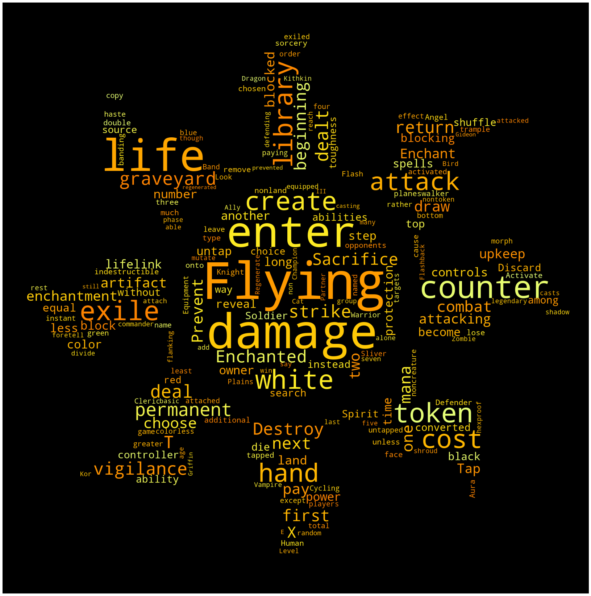
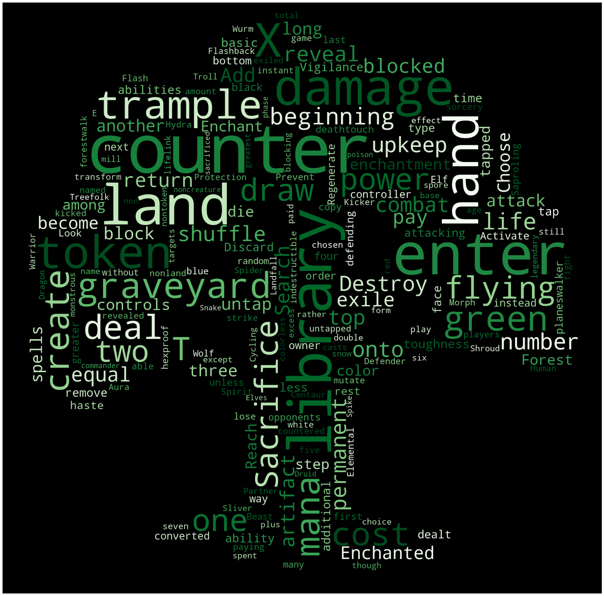
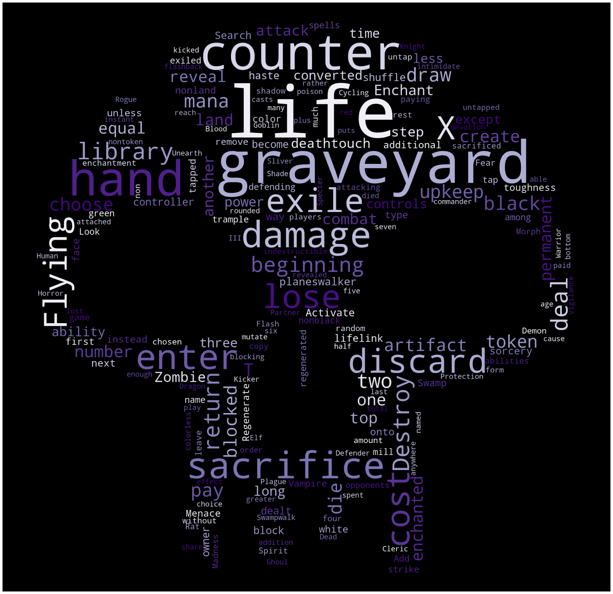
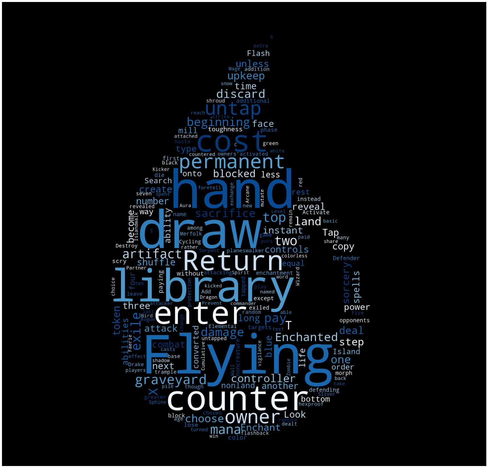

# Making Word Clouds for Magic: the Gathering Colors
A python program that generates word clouds for each of the 5 colors in Magic: the Gathering.  
  
It uses [MtgJson](https://mtgjson.com/) to collect the text from every card of a given color, then puts that text into a [wordcloud](https://amueller.github.io/word_cloud/index.html) module. The resulting cloud is shaped like a mana symbol. 
  
 

 

